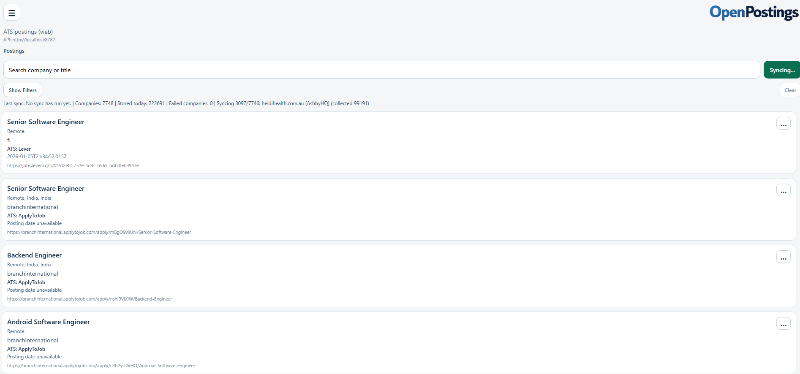
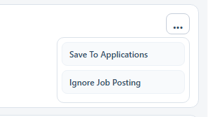
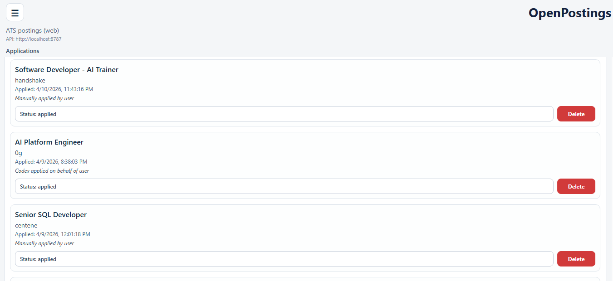
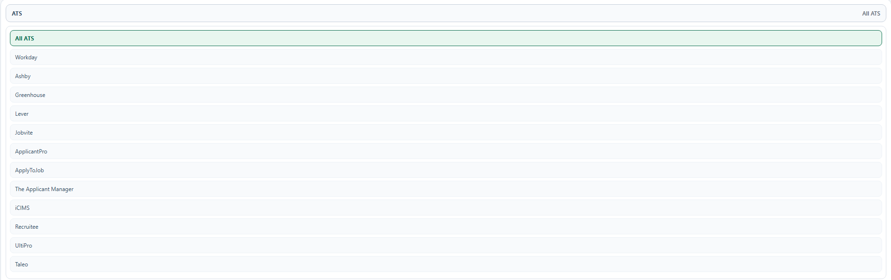
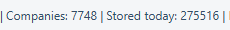

# OpenPostings

OpenPostings is an OpenSource ATS job aggregator and application tracking app. **It pulls jobs that were posted in the last 24 hours** or that has no posted date. 

## Youtube Video
[](https://www.youtube.com/watch?v=5sVIhhwx3Yk)

## Diagram


## Features

It combines:
- A React Native client (`Web`, `Android`, `Windows`)
- A local Node/Express API
- A local SQLite database
- An MCP apply-agent server for agent-assisted workflows


- Pulls jobs from **multiple ATS** providers into one local database.
- Filters postings by **search text, ATS, industry, state, county, and remote mode**.
- Tracks **applied/ignored** posting state and application lifecycle status.
<br>

<br>

- Stores applicant profile and MCP agent settings in SQLite.
- Exposes MCP tools for **candidate selection, cover-letter drafting, and result recording.**

## Supported ATS

Current sync support includes:

- `workday`
- `ashby` / `ashbyhq`
- `greenhouse` / `greenhouse.io`
- `lever` / `lever.co`
- `jobvite` / `jobvite.com`
- `applicantpro` / `applicantpro.com`
- `applytojob` / `applytojob.com`
- `theapplicantmanager` / `theapplicantmanager.com`
- `icims` / `icims.com`
- `recruitee` / `recruitee.com`
- `ultipro` / `ukg`
- `taleo` / `taleo.net`

<br>


About **+7748** companies in total. All gathered from search engine data like Google and DuckDuckGo. 
<br>

<br>
It pulls in new job data at random from companies and stores it in the database. If the posting has lasted longer than 24 hours in the database its no longer used/deleted. 

## Requirements

- Node.js 18+ and npm
  - https://docs.npmjs.com/downloading-and-installing-node-js-and-npm
- For Windows target: React Native Windows prerequisites
  - https://microsoft.github.io/react-native-windows/
- For Android target: Android Studio/emulator or device
  - https://developer.android.com/studio

## Installation

```powershell
cd OpenPostings
npm install
```

## Quick Start (Web)

Terminal 1:

```powershell
cd OpenPostings
npm run server
```

Terminal 2:

```powershell
cd OpenPostings
npm run web
```

Access the Web UI
- `http://localhost:8081`

Default API base URL behavior:
- Web/Windows: `http://localhost:8787`
- Android emulator: `http://10.0.2.2:8787`


## You can run this Windows or Android as well!

```powershell
npm run windows (For windows)
npm run android (For Android)
```


## REST API (Summary)

Core:

- `GET /health`
- `GET /sync/status`
- `POST /sync/ats` (`?wait=1` optional)
- `POST /sync/workday` (alias route)

Postings:

- `GET /postings`
- `GET /postings/filter-options`
- `POST /postings/ignore`

Applications:

- `GET /applications`
- `POST /applications`
- `PATCH /applications/:id`
- `DELETE /applications/:id`

Settings:

- `GET /settings/personal-information`
- `PUT /settings/personal-information`
- `GET /settings/mcp`
- `PUT /settings/mcp`

MCP helper endpoints:

- `GET /mcp/candidates`
- `POST /mcp/cover-letter-draft`
- `POST /mcp/applications/complete`

## MCP Apply Agent Server

You can have Codex/Claude/Gemini/Qwen/LLMs do the following for you:
- Get your applicantee information `get_applicant_context`
- Find the latest relevant jobs for you. `find_posting_candidates`
- Apply to those jobs (As long as your LLM model has access to a browser)
- Build a dynamic cover letter for you that relates to your resume, experience and the job you are applying for. `draft_cover_letter`
- Update job application tracking for you. `record_application_result`

To turn on the MCP server so your model can interact with OpenPostings run:

```powershell
cd OpenPostings
npm run mcp:apply-agent
```

MCP server setup for your Codex (If you use a different LLM, ask it to setup an MCP setup for you):
```
[mcp_servers.openpostings-apply]
command = "node"
args = ['C:\Users\<path to where you cloned the repo>\OpenPostings\server\mcp-apply-server.js']
```


## Security Notes

This is designed for local/self-hosted usage.

- MCP credentials/settings are stored in local SQLite fields.
- If you need stricter controls, add OS-level secret storage, DB encryption-at-rest, and tighter filesystem permissions.
