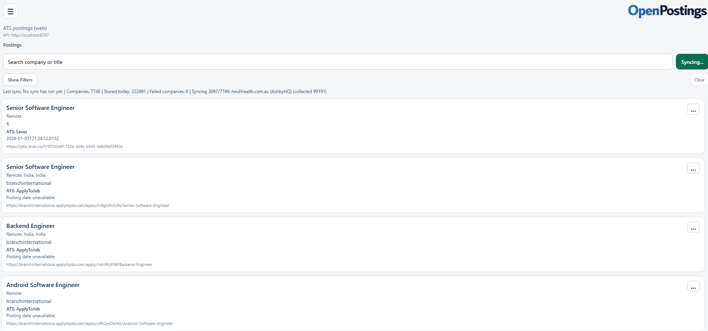
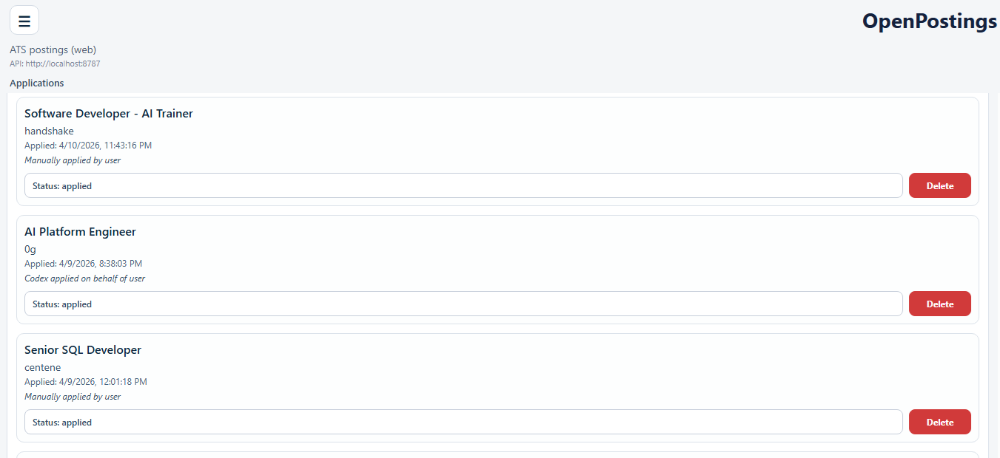

# OpenPostings

<p align="center">
  <span style="font-size:3rem;font-weight:800;letter-spacing:-1px;">
    <span style="color:#f0f0f0;">Open</span><span style="color:#10b981;">Postings</span>
  </span>
</p>

<p align="center">
  <strong>The Indian job hunt, on your terms. Not someone else's.</strong>
</p>

---

**Tired of fake LinkedIn reposts and "AI-powered" job portals that exist to harvest your resume?**

So were we. So we built this.

> No recruiters spamming you about roles nowhere near your stack.
>
> No 6-month-old ghost listings labeled "freshly posted."
>
> No Naukri consultancy reposting the same opening 47 times.
>
> No "Easy Apply" buttons leading to broken redirects.
>
> No "we use AI to match you to your dream job" — followed by your resume getting sold to 12 different recruiting agencies.

Just **30,000+ Indian companies**, scraped direct from 10 ATSes every 30 minutes, stored on **your** laptop. Not someone else's server.

## YouTube Walkthrough

[](https://www.youtube.com/watch?v=5sVIhhwx3Yk)

## What you get

- **30,000+ Indian companies**, pre-loaded on first run — no sign-up, no waitlist, no "verify your phone number."
- **10 ATS integrations** — Workday, Greenhouse, Lever, Ashby, iCIMS, Recruitee, UKG/UltiPro, OracleCloud, Workable, BambooHR. These are the systems Indian companies actually use to post jobs.
- **Last 24 hours only** — stale postings auto-prune every cycle. No ghosts. No reposts. No "this listing has been active for 3 months."
- **28 industry categories** with automatic title classification — you don't need to know whether "DevOps SRE Engineer" lives under Engineering or IT. We figured it out.
- **36 Indian states/UTs and 200+ cities** for location filtering — full coverage, not just Mumbai/Bangalore/Delhi/Hyderabad.
- **Zero cloud dependency** — everything runs on your machine. Your data stays your data.
- **MCP agent support** — pair with Claude, Codex, Gemini, or any MCP-capable LLM. Let it read your profile, find matching jobs, draft cover letters, and (if your model has a browser) actually apply on your behalf.

## Why local-first matters

Every "free" job portal is monetizing you somehow — usually by selling your contact details to recruiters and "career coaches" you never asked for.

OpenPostings runs entirely on your laptop. Your searches, applications, applicant profile, and MCP credentials live in a single SQLite file you own. Delete the file, delete everything. No account to "deactivate." No support ticket to file. No data-residency questions. No GDPR-but-also-not-quite notification emails.

The repo doesn't even ship the database file — `jobs.db` is built from plain-text CSV seeds in `server/data/` on first launch. You can read every byte of the seed data before the app touches your machine.

## Architecture

```
  BROWSER
  localhost:8081
  ┌─────────────────────────────────────────────────────┐
  │  React Native Web (App.js)                          │
  │                                                     │
  │  Pages: Postings · Applications · Profile ·         │
  │         Sync Settings · MCP Settings                │
  │                                                     │
  │  Timers: 5 s → refresh postings + sync status       │
  │          30 s → sync status only                    │
  │          60 min → trigger ATS sync                  │
  └────────────────────┬────────────────────────────────┘
                       │ REST (localhost:8787)
                       ▼
  ┌─────────────────────────────────────────────────────┐
  │  Express API  (server/index.js)                     │
  │                                                     │
  │  /postings            /applications                 │
  │  /postings/ignore     /applications/:id             │
  │  /postings/filter-options                           │
  │  /sync/ats            /sync/status                  │
  │  /settings/personal-information                     │
  │  /settings/mcp                                      │
  │  /mcp/candidates      /mcp/cover-letter-draft       │
  │  /mcp/applications/complete                         │
  │  /health                                            │
  └────────┬──────────────────────────┬─────────────────┘
           │ sqlite/sqlite3           │ triggers every 30 min
           │ WAL · 64 MB cache        │ (+ on-demand POST /sync/ats)
           │ 256 MB mmap              ▼
           │              ┌───────────────────────────────┐
           │              │  Sync Engine                  │
           │              │                               │
           │              │  20 concurrent workers        │
           │              │  worker-stealing queue        │
           │              │  batch flush every 200 rows   │
           │              │                               │
           │              │  Dispatcher → ATS scraper     │
           │              │  ┌──────────┬──────────────┐  │
           │              │  │ Workday  │ Greenhouse   │  │
           │              │  │ Lever    │ Ashby        │  │
           │              │  │ iCIMS    │ Recruitee    │  │
           │              │  │ UKG      │ OracleCloud  │  │
           │              │  │ Workable │ BambooHR     │  │
           │              │  └──────────┴──────────────┘  │
           │              │                               │
           │              │  429 → 60 s back-off + retry  │
           │              │  location cache (in-memory    │
           │              │  Map, rebuilt each sync)      │
           └──────────────└───────────────────────────────┘
                          │
                          ▼
  ┌─────────────────────────────────────────────────────┐
  │  SQLite  (jobs.db — local, never committed to git)  │
  │                                                     │
  │  companies          ← seeded from CSV on first run  │
  │  state_location_index  ← 36 states + 200+ cities   │
  │  job_industry_categories  ← 28 categories           │
  │  job_position_industry    ← 73 k title→industry map │
  │                                                     │
  │  Postings           ← live; pruned after 24 h       │
  │  posting_application_state                          │
  │  applications + application_attribution             │
  │  PersonalInformation                                │
  │  McpSettings                                        │
  └─────────────────────────────────────────────────────┘

  MCP AGENT  (separate process, stdio transport)
  ┌─────────────────────────────────────────────────────┐
  │  server/mcp-apply-server.js                         │
  │                                                     │
  │  Tools:                                             │
  │    get_applicant_context                            │
  │    find_posting_candidates                          │
  │    draft_cover_letter                               │
  │    record_application_result                        │
  │                                                     │
  │  Opens jobs.db directly (not via Express)           │
  │  Dry-run + final-approval mode by default           │
  └─────────────────────────────────────────────────────┘
```

**Boot sequence:** `initDb()` → create tables → seed from CSV (skipped if already populated) → `app.listen(:8787)` → first sync fires immediately → repeats every 30 min. Within ~60 seconds of first launch you have live postings.

**Industry classification:** three-layer matcher runs at scrape time — exact title lookup → phrase n-gram rules → fallback keyword scan. Result cached in `job_position_industry` so repeat titles cost nothing.

**Location inference:** each scraper extracts city/state from the raw posting. Results cached in a per-sync in-memory `Map<url, location>` and replaced atomically at sync end — no DB round-trip per posting during filtering.

## Screenshots



<br>

<br>


## Supported ATS

| ATS | Indian Companies |
|-----|-----------|
| Workday | ~12,000 |
| Greenhouse | ~8,000 |
| Lever | ~4,300 |
| Ashby | ~3,100 |
| UKG / UltiPro | ~900 |
| iCIMS | ~750 |
| Recruitee | ~600 |
| Workable | 24 |
| OracleCloud | 16 |
| BambooHR | 3 |

These are the systems where Indian companies *actually* post jobs. Not portals where the same opening gets re-listed 30 times by different consultancies.

## Install & run

**Requirements:** Node.js 18+ and npm. ([download](https://docs.npmjs.com/downloading-and-installing-node-js-and-npm))

```bash
cd OpenPostings
npm install
```

**Web (recommended):**

```bash
# Terminal 1 — API + sync loop
npm run server

# Terminal 2 — frontend
npm run web
```

- Web UI: `http://localhost:8081`
- API: `http://localhost:8787`

First sync starts within seconds. First batch of postings shows up within a minute.

**Android / Windows** (if you want the native app instead):

```bash
npm run android   # needs Android Studio
npm run windows   # needs react-native-windows prerequisites
```

Android emulator reaches the backend via `http://10.0.2.2:8787`.

## How the database works

We deliberately do not commit a binary `jobs.db` to this repo. Two reasons:

1. **You can see exactly what's seeded.** Every company, every industry, every Indian city is in plain-text CSV under `server/data/`. Inspect it. Diff it. Verify nothing weird is being loaded.
2. **Fresh installs are reproducible.** Two people cloning the repo get byte-identical starting databases.

On first `npm run server`:

1. `jobs.db` is created automatically
2. Seed tables populate from `server/data/*.csv` (companies, industries, locations)
3. Sync cycle starts pulling live postings from all 30,000+ companies
4. Postings older than 24 hours get pruned every cycle

The database is local-only and grows freely on your machine.

## REST API

Core:
- `GET /health`
- `GET /sync/status`
- `POST /sync/ats` — trigger a sync manually (`?wait=1` to block until done)

Postings:
- `GET /postings`
- `GET /postings/filter-options`
- `POST /postings/ignore`

Applications:
- `GET /applications`
- `POST /applications`
- `PATCH /applications/:id`
- `DELETE /applications/:id`

Settings:
- `GET / PUT /settings/personal-information`
- `GET / PUT /settings/mcp`

MCP helper endpoints:
- `GET /mcp/candidates`
- `POST /mcp/cover-letter-draft`
- `POST /mcp/applications/complete`

## MCP Apply Agent

The part where this gets fun. Pair OpenPostings with any MCP-capable LLM (Claude, Codex, Gemini, Qwen, etc.) and the agent can:

- Read your applicant profile — `get_applicant_context`
- Find fresh jobs that match your preferences — `find_posting_candidates`
- Draft a cover letter specific to the role and your resume — `draft_cover_letter`
- Actually apply to jobs (if your LLM has a browser tool)
- Track application results — `record_application_result`

Start the MCP server:

```bash
npm run mcp:apply-agent
```

Config example for Codex / Claude Code:

```toml
[mcp_servers.openpostings-apply]
command = "node"
args = ["<path-to>/OpenPostings/server/mcp-apply-server.js"]
```

By default the agent runs in **dry-run mode with required final approval** — it shows you the cover letter, the form data, and exactly what it's about to do. You decide if it actually submits. No surprise applications, no resume getting fired off to random openings.

## Privacy & Security

This is built for local/self-hosted use. No telemetry, no analytics, no remote services. The app's only outbound traffic is to the ATS endpoints listed above. Open the source if you want to verify.

- All data lives in `jobs.db` on your machine
- MCP credentials and personal information are stored in plaintext SQLite columns. Fine for a personal-use local app. If you share the machine, tighten filesystem permissions on `jobs.db` or add OS-level secret storage.
- No accounts, no sessions, no tokens leaving your network

## Credits

Forked from [Masterjx9/OpenPostings](https://github.com/Masterjx9/OpenPostings). All credit to the original author for the core architecture, ATS scrapers, and MCP agent design.

## Contributing

Pull requests welcome. Bug reports and feature requests go in the Issues tab.
